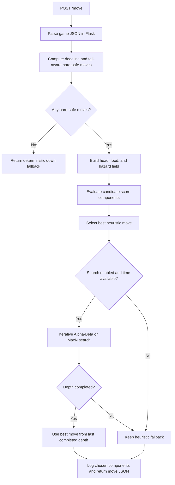

# Architecture

[Documentation index](README.md)

## Repository structure

```text
starter-snake-python/
├── main.py                    # Handlers, safety, pathfinding, strategy, evaluation
├── server.py                  # Flask routes and response header
├── snake/
│   ├── __init__.py
│   └── search.py              # Simultaneous-turn simulation and bounded search
├── tests/                     # Phase, integration, invariant, timing regressions
├── scripts/
│   ├── benchmark.py           # Repeated in-process timing
│   └── practice.py            # Real CLI matches and replay capture
├── docs/                      # Maintainer and operator guides
├── reports/                   # Recorded results and local generated artifacts
├── requirements.txt           # Runtime dependency
├── requirements-dev.txt       # Runtime + test dependency
├── Dockerfile                 # Existing Python 3.10 container entry point
├── README.md
└── LICENSE                    # Original MIT license
```

The main evaluation logic stays in the starter's `main.py`. Only tactical search is split into a package. This avoids a large framework or a rewrite while keeping the most expensive optional computation separate.

## Request lifecycle



`server.run_server` receives the handler functions when `main.py` is executed. The server parses the request and returns the handler's dictionary. It contains no move strategy. `main.move` owns the decision pipeline: it computes a heuristic fallback, gates relevant opponents, and invokes iterative Alpha-Beta or MaxN search within the request deadline. The legacy `choose_move` response model remains a bounded compatibility safety check.

## Two separate board representations

### Physical occupancy

`blocked` is a set of `(x, y)` tuples. Body collisions are represented by membership in that set. Walls are represented by the board bounds, not by inserting an infinite ring of blocked cells.

`get_occupied_cells` contains all current body cells. `get_effective_blocked_cells` can release a unique own tail for a specific non-eating move. Flood fill, BFS, Dijkstra, and legal-move checks use occupancy. The candidate's previous head remains blocked during evaluation because it becomes the new neck; paths must not reverse through it.

### Strategic field

`strategic_weights` maps every in-bounds `(x, y)` to a float. It combines immediate head danger, bounded food attraction, and immediate hazard cost. It does not replace occupancy.

Not every score lives in this map. Reachable space, exits, trap checks, starvation, territory, future safe hazard access, aggression, and search adjustments are separate evaluation components. This distinction matters when adding another strategic feature: changing the field alone will not automatically create a named score component.

## Evaluation versus live decision

`evaluate_move(state, direction, blocked=None, strategic_weights=None)` returns the heuristic sum. It does not run tactical search. `score_move_components` returns the same heuristic split into named contributions, with `search` initially zero.

`move` computes components once for each evaluated legal candidate, chooses a fallback, runs optional search, then updates the chosen move's `search` component for logging. Therefore a logged total can differ from calling `evaluate_move` alone on the same move.

Time limits can stop food-field construction or later candidate evaluations. At least one legal candidate is evaluated if any exist. A completed heuristic pass and search are deterministic on the same state. Under actual deadline exhaustion, the amount of completed work can depend on machine scheduling; partial tactical search is discarded.

## State ownership and dependencies

Every request supplies the full board. There is no mutable global match state, previous-turn cache, database, opponent registry, or persistent learning. The direction and weight globals are configuration and are not mutated during play.

Evaluation copies caller-provided blocked sets. Territory copies occupancy. Simulation deep-copies the input state before moving snakes. The board and body lists in the original request remain unchanged.

`main.py` imports the iterative search entry point and budget constants. Search functions import `main` lazily to reuse the public helpers without a top-level circular import failure. When changing module boundaries, preserve both script execution (`python main.py`) and ordinary import (`import main`).

The algorithms use `deque`, `heapq`, `Counter`, `itertools.product`, and ordinary dictionaries/sets. Flask is the only declared runtime dependency. The practice script additionally needs Git and the installed Battlesnake CLI.

## Compatibility contracts

- `evaluate_move(state, direction)` and the four-argument optimized form both work.
- Never mutate the state, body lists, or a caller's blocked set.
- `get_safe_moves(state)` preserves the original conservative behavior. Live play explicitly uses `tail_aware=True`.
- Head danger remains a soft large penalty; walls and non-vacating bodies are rejected.
- Base strategic weights for a shorter enemy's candidate heads remain zero in a food-free, hazard-free state; gated aggression is added elsewhere.
- The tie order is `up`, `right`, `down`, `left`. With no hard-safe move, the response is still a valid direction: `down`.
- Helpers expect valid game states. This project does not implement a general malformed-JSON recovery layer.

See [Python function reference](function-reference.md) for specific contracts and [Development](development.md) for the regression workflow.
