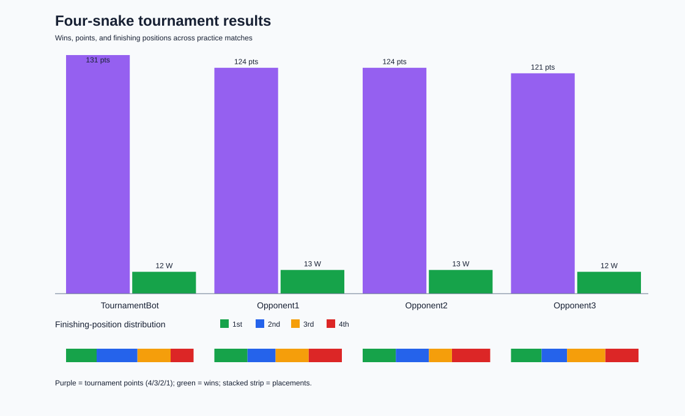

# Four-snake tournament report

Matches: **50**

## Standings

| Rank | Player | Wins | Losses | Points | Average position | 1st | 2nd | 3rd | 4th |
|---:|---|---:|---:|---:|---:|---:|---:|---:|---:|
| 1 | TournamentBot | 12 | 38 | 131 | 2.38 | 12 | 16 | 13 | 9 |
| 2 | Opponent1 | 13 | 37 | 124 | 2.52 | 13 | 11 | 13 | 13 |
| 3 | Opponent2 | 13 | 37 | 124 | 2.52 | 13 | 13 | 9 | 15 |
| 4 | Opponent3 | 12 | 38 | 121 | 2.58 | 12 | 10 | 15 | 13 |

## Visual

Format-specific standings are included in `tournament-results.json`.
